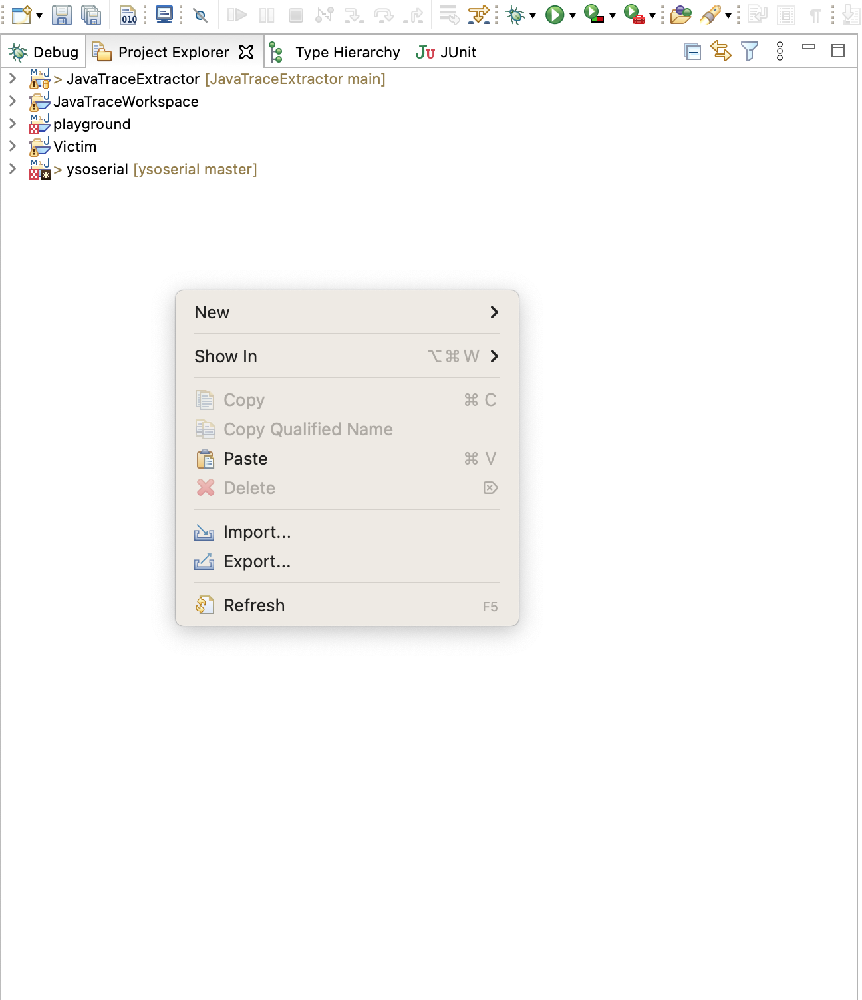
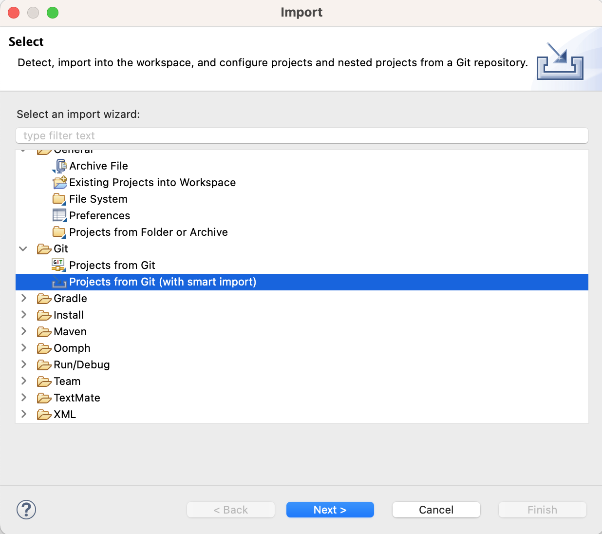
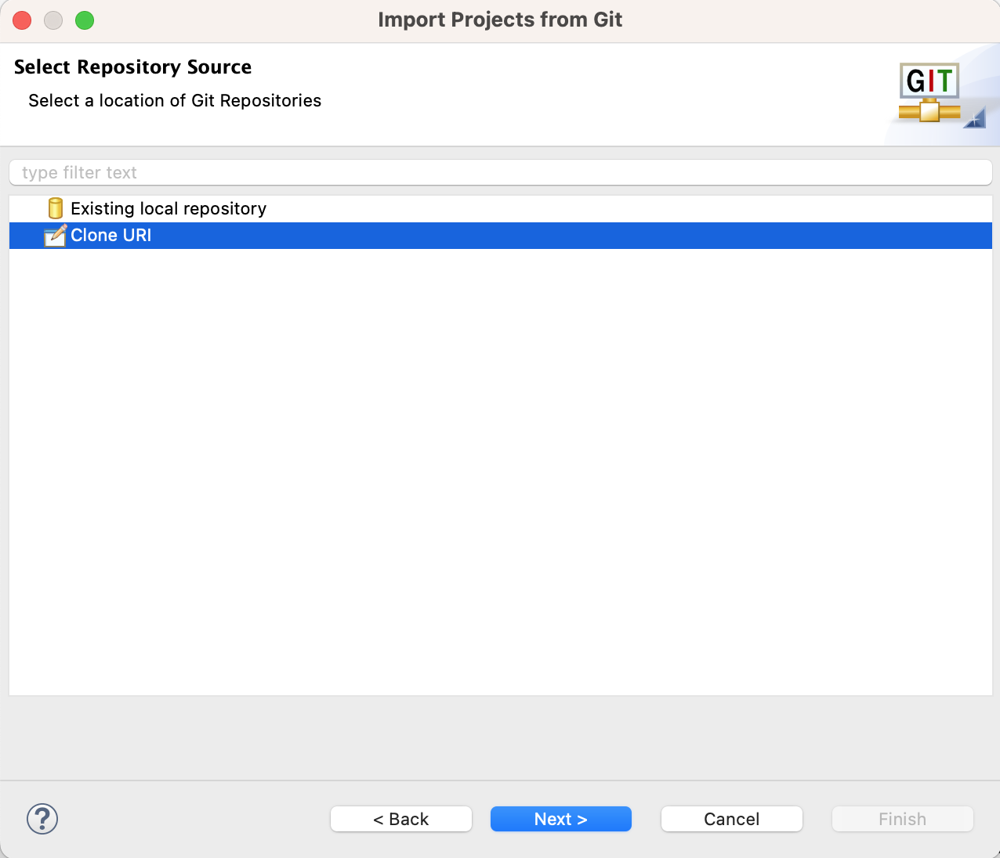
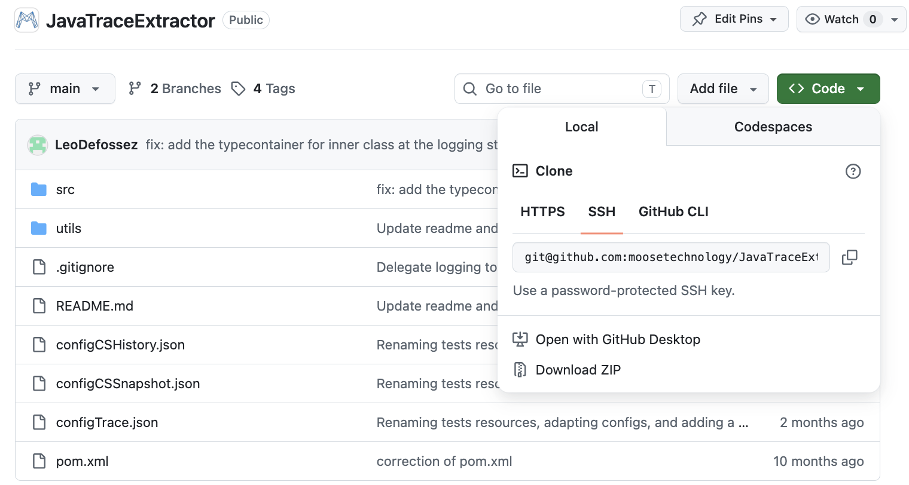
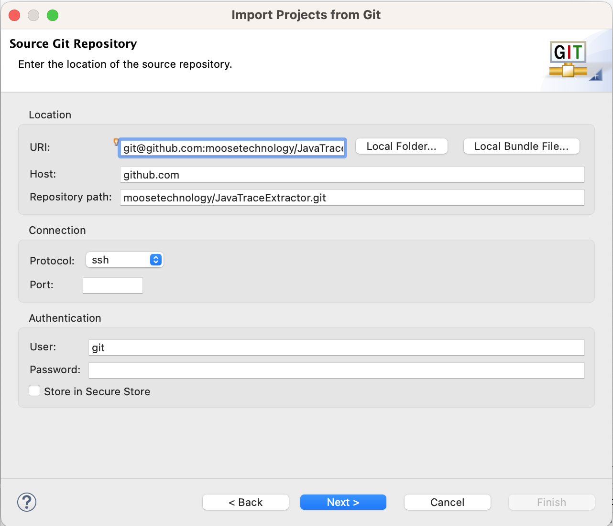
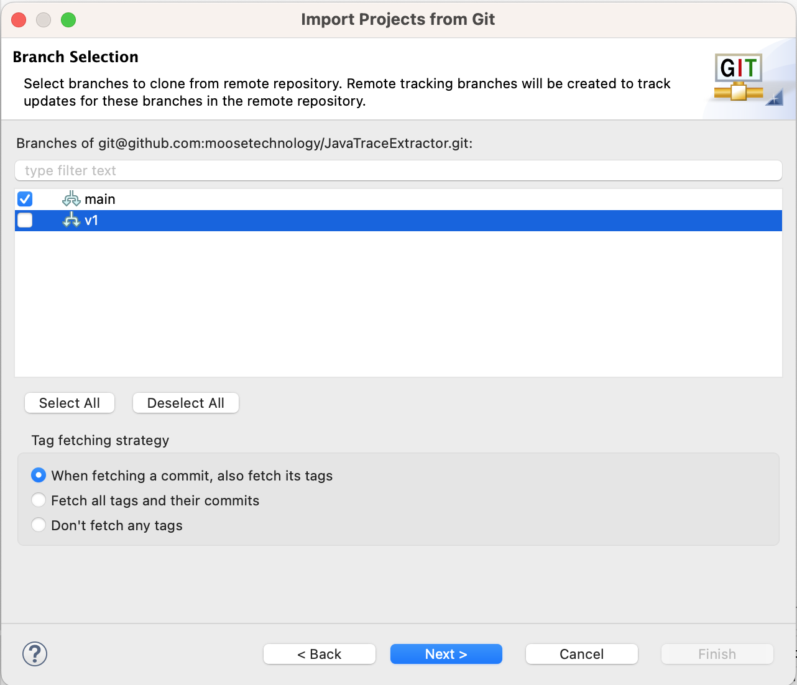
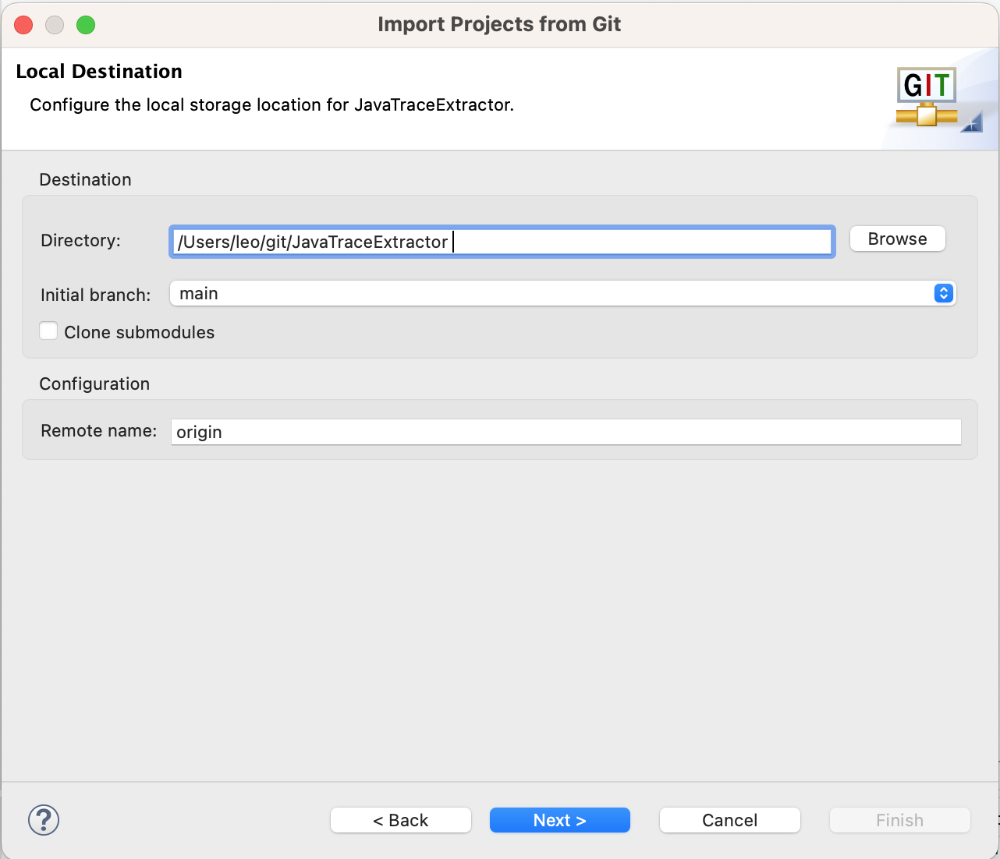
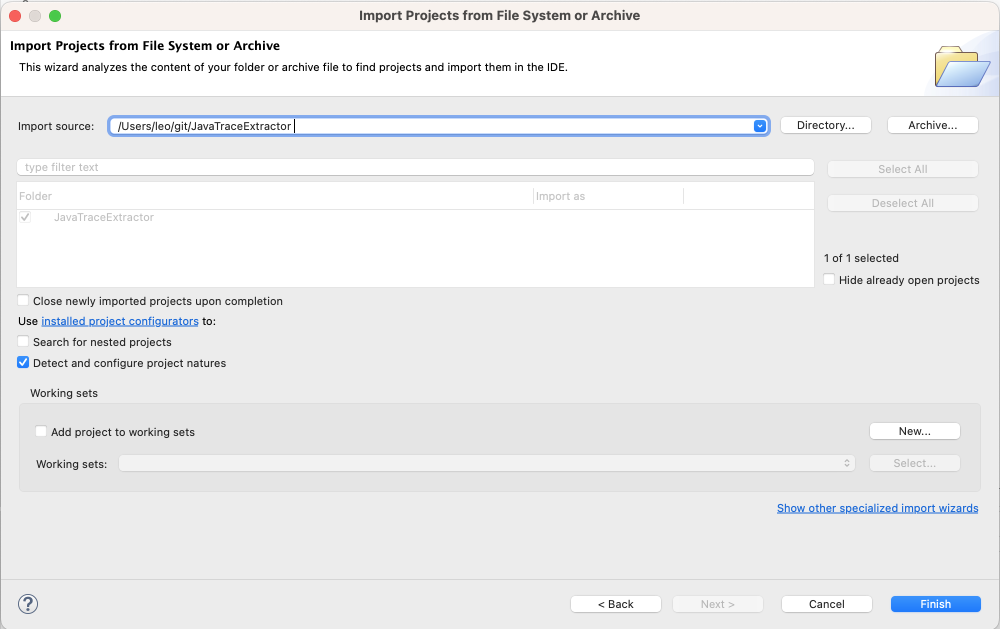

# Download the project
This section explain how to download the project, with eclipse as a reference.

## 1. On eclipse: Right click on the 'Project Explorer' blank part and click on 'Imports...'

## 2. Choose project from git (with smart import)

## 3. Choose the clone URI option

## 4. On your navigator, on the github repository click on '<> Code' and copy the SSH link

## 5. Go back on Eclipse and paster the link in the 'URI' input

## 6. Click on 'next', and choose the branch to download, by default just import the 'main' branch

## 7. Choose the directory and name of the project

## 8. Click on next, and then click on 'finish'

